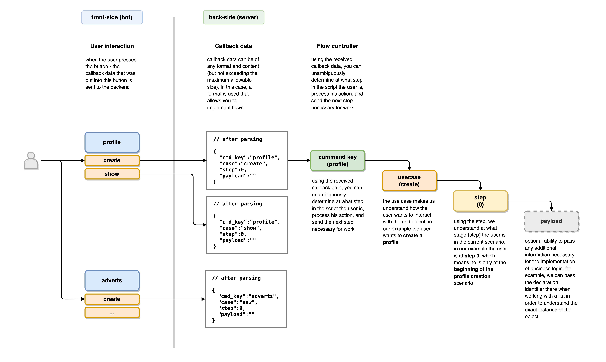

# go-telegram-bot-example

> [!IMPORTANT]
> In this repository I used the library https://github.com/go-telegram-bot-api/telegram-bot-api, however today it is outdated and irrelevant, for this reason I advise using alternative libraries, among which I can confidently recommend https://github.com/go-telegram/bot. I hope I will have free time to update this repository with an up-to-date library and a more correct approach in general.

This repository is an example of the concept of building Telegram (and other) bots, which does not claim to be a standard or an indisputable truth, which provides a simple and readable code divided into separate layers. In particular, a simple concept of working with user scripts has been implemented.  

For a complete immersion in the implementation, it is better to view the source code, which is commented in sufficient detail.

## Basic concept

An object-oriented approach is proposed: business entities are implemented at the application level, over which any manipulations are possible. The command in this case refers to a specific entity (object) with which it is planned to perform actions (see diagrams below).

### Project structure

The code is structured and organized based on the **simplified** concept of [clean architecture](https://blog.cleancoder.com/uncle-bob/2012/08/13/the-clean-architecture.html). 

```
├── assets
│   ...
├── cmd
│   └── go-telegram-bot-example
│       // configuration file and main.go, no more
├── internal
│   ├── bot
│   │   // application's internal packages directory
│   ├── config
│   │   // application configuration
│   ├── database
│   │   // state store configuration and initialization
│   ├── flow
│   │   // the same example of implementing custom scripts
│   ├── logger
│   │   // logging initialization with necessary parameters
│   ├── messages
│   │   // here are the messages that we broadcast to the user through the bot
│   ├── model
│   │   // all business entities of the application and auxiliary methods for them
│   ├── repository
│   │   // methods of interaction with the state store (at this level, there can also be calls to external APIs, working with the cache, etc.)
│   └── service
│       // all business logic of the application should be implemented here (work with repositories, etc.)
└── migrations
    // migration files
```

## The concept of working with bot commands

In this example, bot commands are perceived as starters of some user scripts and/or flow in general. At the level of command handlers, any preparatory business logic necessary for further work can be implemented.


## The concept of working with callbacks

After executing commands, the user interacts with a specific object and execution script. Therefore, we can use callback data to receive and process user actions.



## An example of the described flow

```go
model.Flow{
  model.ProfileCommand: model.Usecase{
    "create": model.Chain{
      0: model.Action{
        Handler: svc.Profile.Create,
	Message: profile.Create(),
      },
    },
  },
}
```
```json
{
   "profile":{
      "create":{
         "0":{
            "handler": HandlerFunc(),
            "message":"Click the button below to create a profile",
            "buttons":[
               {
                  "name":"Create profile",
                  "callback_data":{
                     "cmd_key":"profile",
                     "case":"create",
                     "step":0,
                     "payload":""
                  }
               }
            ]
         }
      }
   }
}
```

## What else?

Open an issue or PR if you have more suggestions, questions or ideas about what to add.
